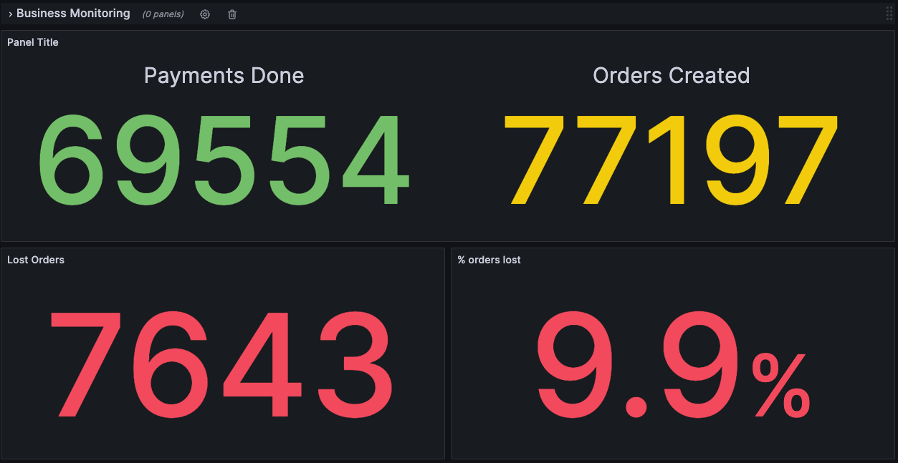

Personal project to study architecture evolution using sagas and simulating real world problems.

## First Release

* Synchronous communication with no retries
* Gateway payment fails 10% of time
* No SLAs defined yet

### Problem

* With synchronous communication and no retries our results are attached to payment gateway SLO.

## Second Release

* Add retry mechanism on gateway payment.

